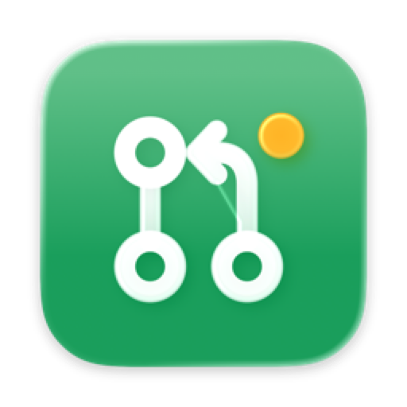
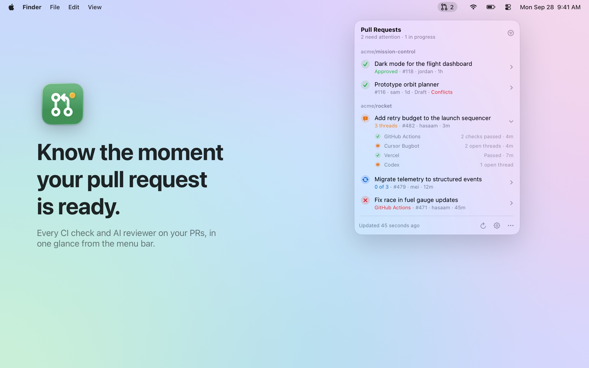
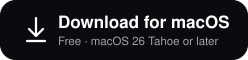
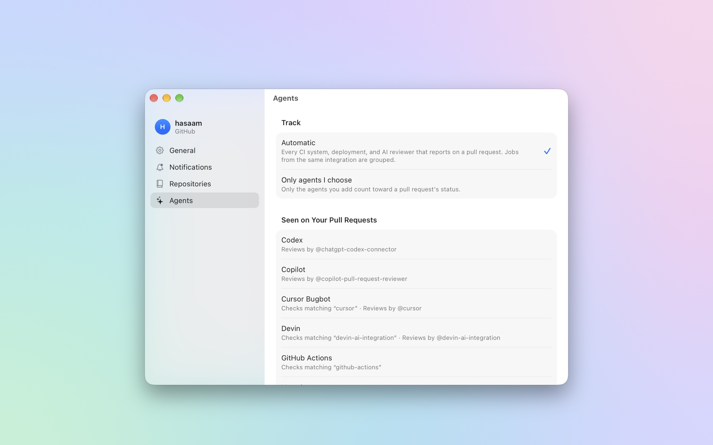
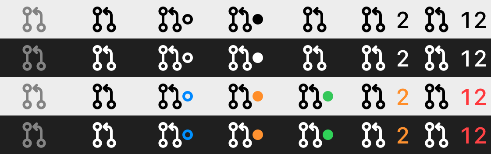

<p align="center">
  
</p>

<h1 align="center">PR Monitor</h1>

<p align="center">
  <b>Know the moment your pull request is ready.</b><br>
  Every CI check and AI code reviewer on your pull requests, in one glance from the macOS menu bar.
</p>

<p align="center">
  <a href="https://github.com/BlockchainHB/PR-Monitor/releases/latest"></a>
  
  
  <a href="https://github.com/BlockchainHB/PR-Monitor/actions/workflows/ci.yml"></a>
  <a href="LICENSE"></a>
</p>

<p align="center">
  <a href="#install">Install</a> ·
  <a href="#how-status-is-decided">How it works</a> ·
  <a href="#faq">FAQ</a> ·
  <a href="docs/ARCHITECTURE.md">Architecture</a>
</p>

<p align="center">
  <picture>
    <source media="(prefers-color-scheme: dark)" srcset="docs/screenshots/hero-dark.jpg">
    <source media="(prefers-color-scheme: light)" srcset="docs/screenshots/hero-light.jpg">
    
  </picture>
</p>

<p align="center">
  <a href="https://github.com/BlockchainHB/PR-Monitor/releases/latest/download/PRMonitor.dmg">
    <picture>
      <source media="(prefers-color-scheme: dark)" srcset="docs/assets/download-dark.svg">
      
    </picture>
  </a>
</p>

## Why

Modern pull requests are reviewed by a crowd: CI, a preview deploy, and two or three AI reviewers that each finish on their own schedule. The usual way to keep track is to refresh tabs.

- **Wait once, not five times.** PR Monitor tells you when *every* agent has finished on your latest push, so you can read all the feedback in one focused pass.
- **See what needs you.** Failing checks and unresolved review threads stand out. Everything that's fine stays quiet.
- **Zero setup.** Point it at your repositories and it discovers your CI and review bots on its own.

## Highlights

- **Accurate.** Reads check runs *and* commit statuses, unresolved review threads, pending review requests, and which commit each review was on.
- **Quiet notifications.** Nothing on launch, one notification per push, and a follow-up only if new feedback arrives. Clicking one opens the PR.
- **Light on GitHub's API.** One batched GraphQL request per ten repositories. Full details load only for PRs that changed, which costs about 1 point per repository per poll.
- **Resilient.** Recovers after sleep and network changes, backs off on errors, and waits out rate limits. A repository you've lost access to never blanks the list.
- **Native.** SwiftUI and Liquid Glass, a template menu bar icon, skeleton loading, VoiceOver labels, and light and dark appearances.

## Works with

Every check and review bot is detected automatically. These are also available as one-click presets:

| Agent | Checks | Review threads |
| --- | :---: | :---: |
| GitHub Actions | ✓ | |
| Vercel · Netlify | ✓ | |
| Cursor Bugbot | ✓ | ✓ |
| CodeRabbit | ✓ | ✓ |
| Devin | ✓ | ✓ |
| Graphite · Greptile | ✓ | ✓ |
| Codex · Copilot · Gemini Code Assist · Sourcery | | ✓ |
| *Anything else that posts a check, status, or review* | ✓ | ✓ |

## Install

1. [Download **PRMonitor.dmg**](https://github.com/BlockchainHB/PR-Monitor/releases/latest/download/PRMonitor.dmg) and drag **PR Monitor** into Applications.
2. Open it and click the pull request icon in the menu bar.
3. Choose **Continue with GitHub CLI** if you use `gh`. Otherwise sign in with GitHub or a personal access token.
4. Pick the repositories to watch. That's it.

Requires macOS 26 Tahoe or later. Releases are signed with a Developer ID and notarized by Apple.

<p align="center">
  
</p>

## How status is decided

Each **agent** gets one state per pull request:

| State | When |
| --- | --- |
| **Running** | A matching check is queued or in progress, the bot is still a requested reviewer, or a configured agent hasn't reported within 3 minutes of a push |
| **Failed** | A matching check failed, timed out, needs action, or failed to start, including workflows awaiting approval |
| **Needs review** | Finished, but left unresolved review threads on current code, or requested changes |
| **Passed** | Finished with nothing outstanding (skipped, neutral and cancelled checks aren't failures) |

The pull request takes the most important of these: **Failing › Running › Needs review › Ready**. It's **settled** once nothing is running, which is when you're notified. If GitHub's own roll-up says checks are still pending but none are visible, PR Monitor trusts GitHub.

The rules live in one pure function, [`StatusEngine`](Sources/PRMonitor/Core/StatusEngine.swift), with a unit test for each rule.

<details>
<summary><b>Menu bar icon states</b></summary>
<br>
<p align="center"></p>

By default the icon is a template image that matches the other menu bar icons, as Apple recommends. The shape carries the state: a ring means agents are running, a dot means something needs you, and a number counts the pull requests that need you. Colored badges are available in Settings.
</details>

## Privacy

- Talks only to GitHub (`api.github.com` and `github.com`). No analytics, no telemetry, no servers of its own.
- Your token lives in your login keychain, and settings live in `UserDefaults`.
- Needs the `repo` scope to read checks on private repositories. A fine-grained token with read access to pull requests, checks and commit statuses also works.

## FAQ

<details>
<summary><b>I don't see the icon in the menu bar.</b></summary>
<br>
In macOS 26, open System Settings › Menu Bar and make sure PR Monitor is allowed. On a crowded menu bar, macOS may also hide icons that don't fit.
</details>

<details>
<summary><b>A repository shows a warning triangle.</b></summary>
<br>
GitHub couldn't load it: it was renamed, you lost access, or your organization restricts third-party OAuth apps. Hover the triangle for details. The GitHub CLI sign-in usually works where OAuth apps are restricted.
</details>

<details>
<summary><b>Will it use up my GitHub API rate limit?</b></summary>
<br>
No. A typical poll costs about 1 point per repository out of 5,000 per hour. PR Monitor slows down once everything has settled, and always leaves headroom for your other tools.
</details>

<details>
<summary><b>Does it support GitHub Enterprise?</b></summary>
<br>
Not yet. It talks to github.com only.
</details>

<details>
<summary><b>Why macOS 26?</b></summary>
<br>
It's built on the Liquid Glass design system and macOS 26 APIs such as `Observations`, with Swift 6 strict concurrency throughout.
</details>

## Build from source

```bash
git clone https://github.com/BlockchainHB/PR-Monitor.git
cd PR-Monitor
open PRMonitor.xcodeproj   # ⌘R to run, ⌘U to test
```

Or run the 39 unit tests from the command line with `swift test`. Read [docs/ARCHITECTURE.md](docs/ARCHITECTURE.md) for how it's built, [docs/RELEASING.md](docs/RELEASING.md) for how releases are signed and notarized, and [CONTRIBUTING.md](CONTRIBUTING.md) to get involved.

## License

MIT © Hasaam Bhatti. Screenshots use fictional repositories.
